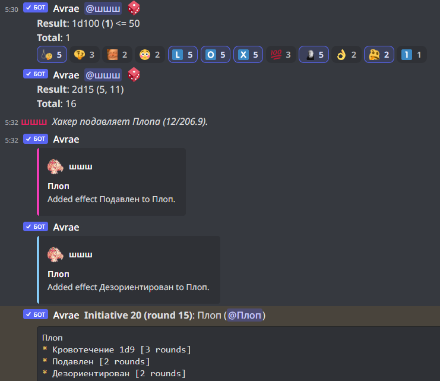
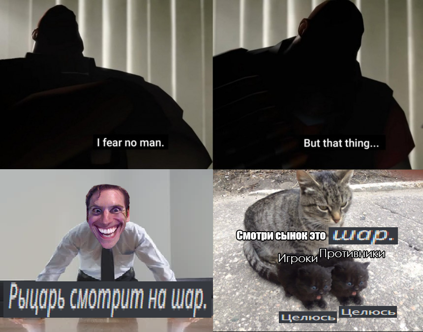
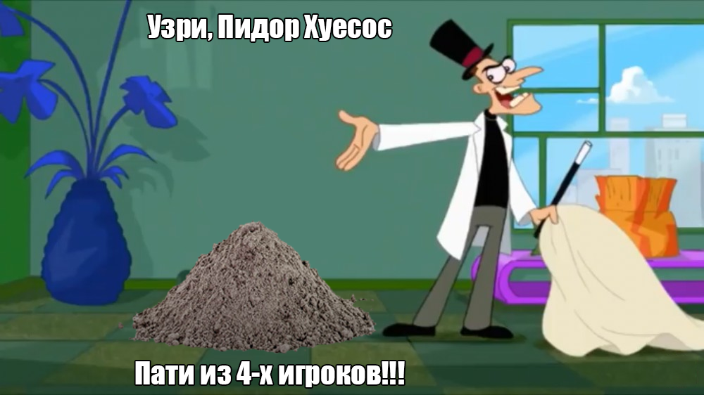
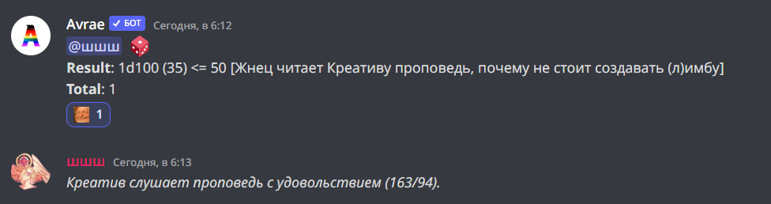
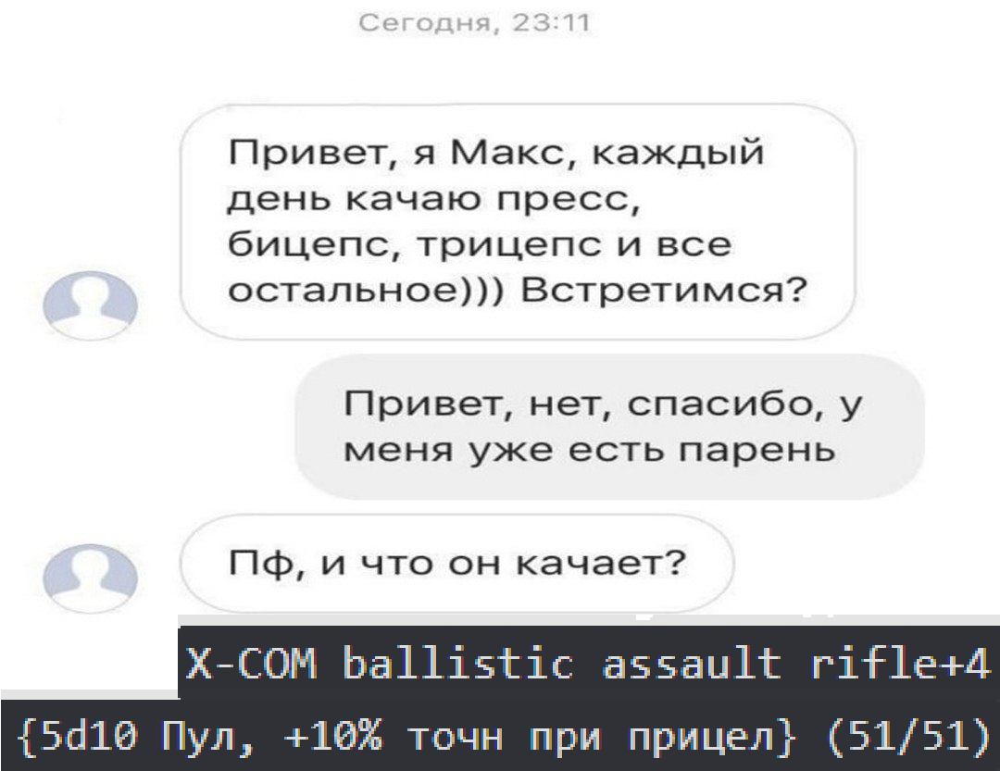
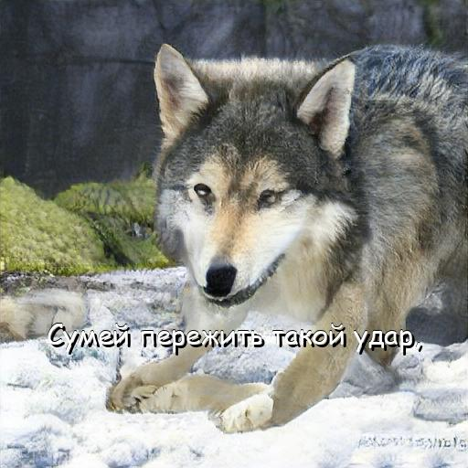

---
hide:
    - navigation
---

# Веселье!

## Проигрывать в ДоБЛе - естественно и весело (должно быть)

Даже если ты проиграл, не стоит в сию же минуту опускать руки и бросать игру.

ДоБЛ полон коварного ***рандома***, и ты мало что действительно можешь сделать.
Однако, с каждой смертью ты будешь больше понимать и осознавать, что побудит создавать интересных и сильных персонажей.

!!! tip "Наслаждайся времяпровождением с другими игроками!"

## le memes

Лучше посмотри мемы, которые создало сообщество.

{width=454; allign=left}
{width=500; allign=right}

<figure markdown>
  { width="600"}
  <figcaption>Пати вайп</figcaption>
</figure>

<figure markdown>
  { width="600"}
  <figcaption>(Л)Имба</figcaption>
</figure>

{width=500; allign=left}
{width=387; allign=right}

<figure markdown>
  { width="600"; }
  <figcaption>Спойлер</figcaption>
</figure>

<figure markdown>
  { width="600"; }
  <figcaption>Разница</figcaption>
</figure>

## Пасты

???+ abstract "`ЧТО БЫЛО В ДОБЛЕ. ЧТО МЫ ПОТЕРЯЛИ`: CreativeeBlackWolf (c)"
    ЧТО БЫЛО В ДОБЛЕ. ЧТО МЫ ПОТЕРЯЛИ.

    1. ИГРОКОВ ДЕЛАЛИ ИЗ ЭССЕНЦИЙ. МОЖНО БЫЛО АЙТЕМЫ КОРМИТЬ.
    2. СИЛА ГРАВИТАЦИИ БЫЛА СЛАБЕЕ НА 80 ПРОЦЕНТОВ. ЛЮДИ НА ДРУГОЙ КОНТИНЕНТ С РАЗБЕГУ ЗАПРЫГИВАЛИ.
    3. ЧЕЛОВЕК ЖИЛ С СРЕДНЕМ 15-18 ДНЕЙ. БОЛЕЗНЕЙ НЕ СУЩЕСТВОВАЛО КРОМЕ ВАЙПА.
    4. ЕСЛИ НА УЛИЦЕ СПОТКНЕШЬСЯ И УПАДЕШЬ - ЛЮДИ ПОДБЕГАЛИ, БАН В КАРМАН ЗАСОВЫВАЛИ, В ГУБЫ ЦЕЛОВАЛИ, ПРЕДЛАГАЛИ УБИТЬ ВЕНТУСА, ЛУТ РАЗДЕЛИТЬ.
    5. ЭССЕНЦИИ И ХЛАМ СРАЗУ В ИНВЕНТАРЬ ЗАЛЕТАЛИ.
    ДМУ МОЛИШЬСЯ - ТЕБЕ ЕЩЁ НАКОВАЛЬНЯ С НЕБА ПРИЛЕТАЕТ.
    К ЗАМКУ ПОДОЙТИ СТРАШНО БЫЛО: ЖЕТОНЫ В РЮКЗАК ПРИЛЕТАЛИ.
    6. ОНИКС РАССКАЗЫВАЛ: ЛЮДИ НОЧЬЮ ПРОСЫПАЛИСЬ ОТ БЕСКОНЕЧНЫХ РАСКОПОК. УТРОМ ВСЕ ОБЛИВАЛИСЬ РАНДОМНЫМИ ЗЕЛЬЯМИ.
    7. ЛЮДИ ПРИГЛАШАЛИ ИГРОКОВ РАЗ В ∞ ДНЕЙ. ПЕРСОНАЖИ СОЗДАВАЛИСЬ С 12-15 СЛОТАМИ В ИНВЕНТАРЕ И ТЫСЯЧЕЙ ЖЕТОНОВ - СРАЗУ НА ПОЛУБОГОВ ПРОСИЛИСЬ.
    8. ВОДА В МОРЕ БЫЛА СЛАДКАЯ КАК ПАТОКА. А ФОНТАНЫ СОСТОЯЛИ ИЗ ТЁМНОГО ПИВА.
    9. ВОЗРОЖДЕНИЕ СТОИЛО 100 ДУШ. ВСЕ ПОЛУМЁРТВЫЕ ХОДИЛИ.
    10. ЭССЕНЦИИ РОСЛИ НА КУСТАХ С ДЕРЕВО РАЗМЕРОМ. А ДЕРЕВО С ПОЛУБОГА, ПОЛУБОГ С КОНТИНЕНТ, А КОНТИНЕНТ КАК КАЗИНО, А В КАЗИНО МУЖИКИ В БЛЭКДЖЕК ИГРАЛИ ПО МАРТИНГЕЙЛУ - КАЗИНО БАНКРОТИЛОСЬ С ПЕРВОЙ ИГРЫ!

???+ abstract "`Меня зовут Бойз`: Пустой (c)"
    Меня зовут Бойз. Мне 33 года. Мой дом находится на первом инстансе, в районе этажей. Я не женат. Работаю орком сети данжей "ДоБЛ" и в инстанс возвращаюсь, самое позднее, в 1 час ночи. Не критую, антикритую изредка. К 5 утра я ложусь. Всегда сплю не больше 3 часов. Перед сном я 4 раза подряд антикритую, а также минут 20 уделяю созданию нового персонажа, поэтому до вечера я сплю без особых проблем. Вечером я просыпаюсь, не чувствую ни смысла жизни, ни радости. На медосмотре мне сказали, что я конченный.

    Я - орк, желающий ВааАААААААААААГГГГгггХХХХ!!! Я не забиваю себе голову проблемами вроде расчленения противников или их пожирания и не обзавожусь друзьями, которых не могу съесть. Я знаю наверняка: в таком способе взаимодействия с обществом и кроется счастье. Хотя даже в битве я бы никому не проиграл. ВАААААААААаааааааГГГГГГггХХХХ!!!

???+ abstract "`АНТИДОБЛ`: solidude (c)"
    ПОПАДАЕТ ИГРОК В АНТИМИР АНТИДОБЛА

    @

    ЗАБЛУДИВШИСЬ В АНТИКОРИДОРАХ ПОПАДАЕТ В АНТИБОЙ

    @

    В ПЕРВОМ ЖЕ ХОДУ ВЫБИВАЕТ АНТИКРИТ 
